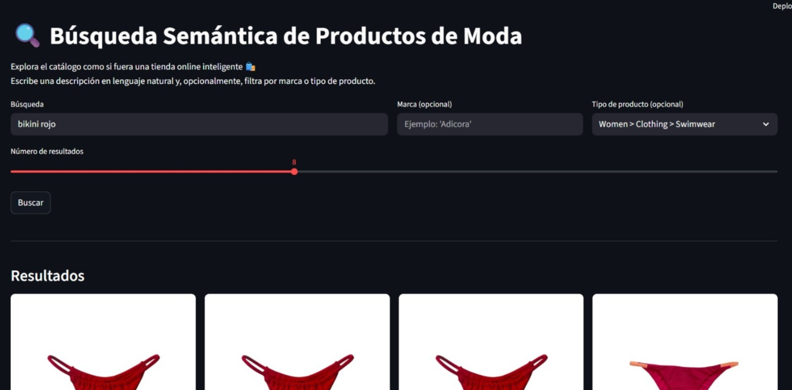
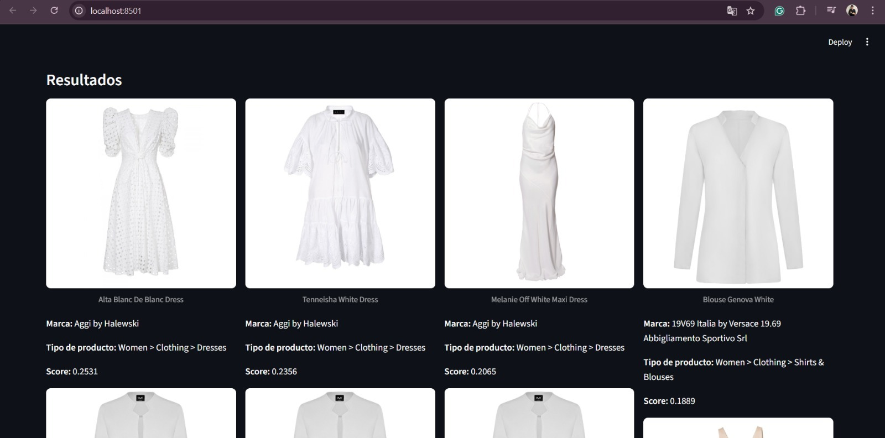

# Multimodal-Semantic-Search-Engine
Motor de búsqueda inteligente para E-commerce utilizando Vector Embeddings y modelos de IA (CLIP).

# 🛍️ Sistema de Búsqueda Semántica Multimodal (CLIP-Powered)

> *"Rompiendo la barrera del texto: Buscando productos por lo que significan, no solo por cómo se etiquetan."*

En la era del Big Data, el 80% de la información es "no estructurada" (imágenes, texto libre). Este proyecto implementa un motor de búsqueda de **próxima generación** que utiliza Inteligencia Artificial para entender el lenguaje natural y recuperar imágenes visualmente compatibles, superando las limitaciones de los buscadores tradicionales por palabras clave.

## 🧠 El Desafío de Negocio: La "Ceguera" de los Buscadores Clásicos
Los sistemas SQL tradicionales fallan cuando la intención del usuario no coincide con la etiqueta exacta del producto (ej. buscar *"algo elegante para una boda en la playa"*).
* **El Problema:** Pérdida de ventas por resultados vacíos ("No results found").
* **La Solución:** Un **Espacio Vectorial Compartido** donde texto e imágenes coexisten matemáticamente.

---

## 👁️ Prueba de Concepto: Entendiendo la Intención del Usuario
El sistema no busca coincidencias de texto, busca **similitud semántica**. A continuación, dos ejemplos reales del funcionamiento del prototipo en Streamlit.

### Caso 1: Búsqueda por Concepto (Interfaz de Usuario)
> 
>
> * **Input:** El usuario busca "Bikini rojo" (o conceptos relacionados al verano/color).
> * **Resultado:** El modelo **CLIP** interpreta la consulta y recupera instantáneamente productos que coinciden visualmente con la descripción, rankeados por score de similitud.
> * **Valor:** Interfaz funcional desplegada en **Streamlit** que permite al usuario interactuar con la IA en tiempo real.

### Caso 2: Precisión Visual (Computer Vision)
> 
>
> * **Consistency Check:** Al buscar términos como "Vestido blanco elegante", el sistema filtra el ruido y devuelve una grilla de productos visualmente coherentes.
> * **Tecnología:** Esto demuestra la capacidad de la **Base de Datos Vectorial (Qdrant)** para realizar búsquedas de "Vecinos más Cercanos" (ANN) en milisegundos sobre un catálogo masivo.

---

## 🛠️ Arquitectura Técnica
El flujo de datos combina Deep Learning con almacenamiento de alto rendimiento.

### 1. El Cerebro: OpenAI CLIP
* **Función:** Modelo multimodal que convierte imágenes y texto en *Embeddings* (vectores de 512 dimensiones).
* **Innovación:** Permite búsquedas "Zero-Shot", es decir, el modelo reconoce objetos que nunca vio durante su entrenamiento explícito.

### 2. La Memoria: Qdrant (Vector Database)
* **Indexación:** Almacenamiento optimizado de vectores.
* **Filtrado Híbrido:** Capacidad de combinar la búsqueda semántica (vectorial) con filtros de negocio tradicionales (ej. *Precio < $50*).

---

## 🚀 Impacto Potencial
Este proyecto valida competencias críticas para el rol de Científico de Datos moderno:
1.  **Manejo de Datos No Estructurados:** Capacidad para procesar imágenes y texto, no solo tablas de Excel.
2.  **Innovación en UX:** Mejora la tasa de conversión en E-commerce al ofrecer resultados más relevantes.
3.  **Automatización:** Elimina la necesidad de etiquetado manual intensivo (Auto-Tagging).

## 📦 Stack Tecnológico
* **Lenguaje:** Python 3.9+
* **IA / Embeddings:** `Transformers`, `OpenAI CLIP`.
* **Base de Datos:** `Qdrant` (Vector Search Engine).
* **Frontend:** `Streamlit`.
* **Procesamiento:** `Pillow` (Imágenes).

---
*Proyecto de Innovación en IA | Summer Camp PUCP 2026*
